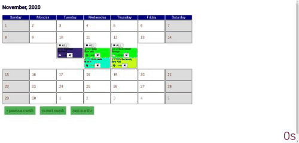

# CalendarChallenge

This project is a calendar app that will show a month view of a calendar of the current month made with Angular 10.

# TL;DR

You must have Node.js installed on your computer. On the directoty root, please run `npm install` then `ng serve --open`, and the project will open on your default browser. You can perform the tests with Jusmine by running `ng test`. 

# How to use

You can click on any day and a dialog will open where you can input a reminder up to 30 characters, a city to get the weather forecast and a color for the reminder. You can also edit any reminder or delete it, or 
even delete all reminders from a given day.

 You can also navigate through months.

# Sources

Icon provided by https://github.com/Keyamoon/IcoMoon-Free.
Weather api provided by https://openweathermap.org/api.
This project uses NGRX as its state management system.

